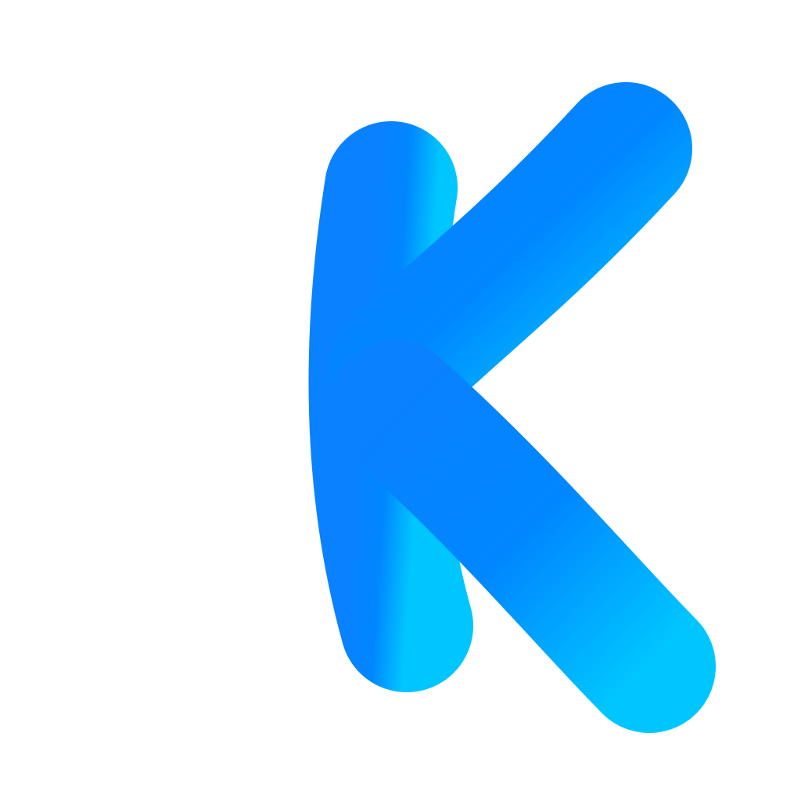
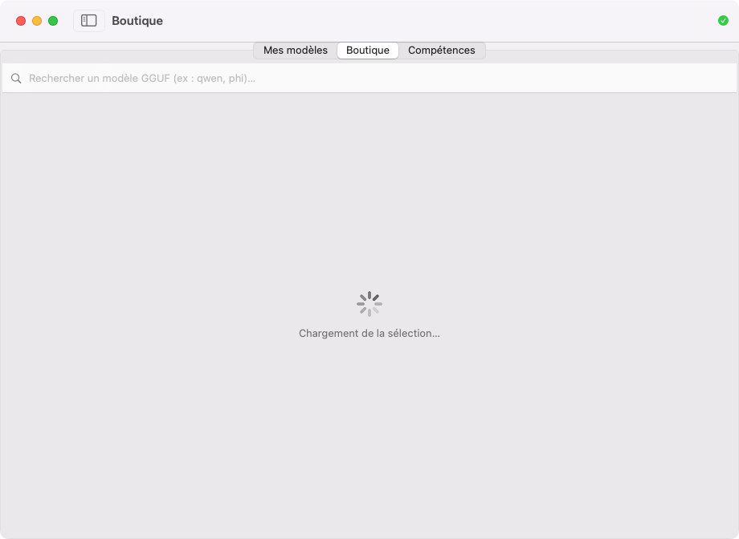
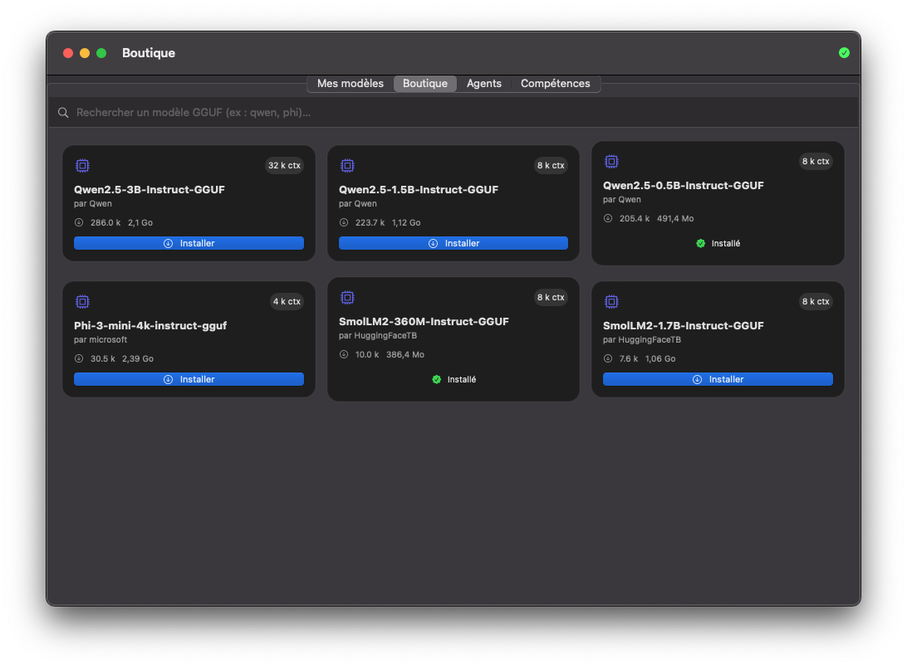
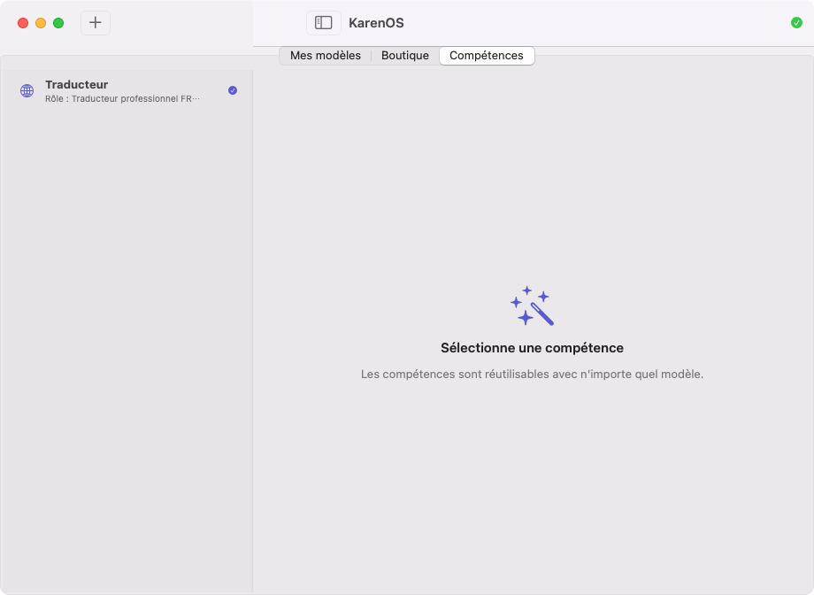
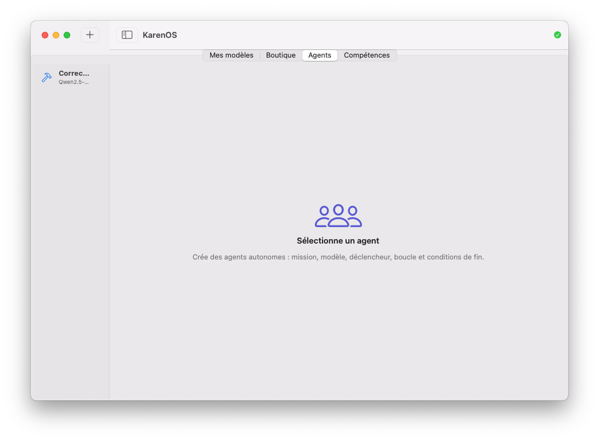

# KarenOS

<p align="center">
  
</p>

<!--
    SEO — KarenOS · Project reference: https://github.com/martialzinsou/KarenOs
    Canonical: https://github.com/martialzinsou/KarenOs
    Author: Martial Zinsou
    Function: IT Director (DSI)
    Title: KarenOS — 100% local generative AI application for macOS
    Description: KarenOS is a native macOS application allowing to download GGUF models from Hugging Face and chat with them entirely locally. Streaming chat via llama.cpp, autonomous agents, multimodal (images, video, audio, voice dictation), reusable skills. No data leaves the machine. Ideal for DSI, IT Directors, IT governance, sovereign infrastructure.
    Keywords: karenos, local ai, offline ai, macos, swift, swiftui, llama.cpp, gguf, hugging face, autonomous ai agents, multimodal, local chatbot, martial zinsou, dsi, it director, it director, governance it, digital transformation, sovereign infrastructure, local llm, generative ai local
    Language: en
    robots: index, follow
    og:title: KarenOS — 100% local generative AI for macOS
    og:description: Download GGUF models from Hugging Face and chat with them entirely locally. Autonomous agents, multimodal, skills, zero data exiting.
    og:type: website
    og:url: https://github.com/martialzinsou/KarenOs
    og:image: https://raw.githubusercontent.com/martialzinsou/KarenOs/main/docs/branding/karenos-logo.png
    twitter:card: summary_large_image
    twitter:title: KarenOS — local AI macOS
    twitter:description: 100% native macOS generative AI application with autonomous agents and multimodal.
-->

<!-- JSON-LD Structured Data for SoftwareApplication -->
<script type="application/ld+json">
{
  "@context": "https://schema.org",
  "@type": "SoftwareApplication",
  "name": "KarenOS",
  "applicationCategory": "DeveloperApplication",
  "operatingSystem": "macOS 13+",
  "offers": {
    "@type": "Offer",
    "price": "0",
    "priceCurrency": "EUR",
    "availability": "https://schema.org/InStock"
  },
  "author": {
    "@type": "Person",
    "name": "Martial Zinsou",
    "url": "https://github.com/martialzinsou"
  },
  "description": "Application native macOS of 100% local generative AI: download GGUF models, streaming chat, autonomous agents, multimodal, skills.",
  "keywords": "karenos, local ai, macos, swift, swiftui, llama.cpp, gguf, agents ai, multimodal, dsi, it director",
  "license": "https://opensource.org/licenses/MIT",
  "url": "https://github.com/martialzinsou/KarenOs",
  "downloadUrl": "https://github.com/martialzinsou/KarenOs/releases/tag/v1.0.0",
  "version": "1.0.0",
  "datePublished": "2026-09-21",
  "publisher": {
    "@type": "Person",
    "name": "Martial Zinsou"
  }
}
</script>

Application native macOS for using AI models **locally**: download GGUF models from Hugging Face, then chat with them, all on your machine.

**Author: Martial Zinsou**

## Screenshots



*My models: local library and local chat.*



*Model store: browsing and installing GGUF models from Hugging Face.*



*Skills: reusable instructions with any model.*



*Agents: autonomous missions on a chosen model, with trigger (manual, on launch, every X seconds), infinite loop and end conditions (number of iterations, duration, success keyword). The model is automatically loaded and the previous one is restored.*

## Features

- **Store**: selected GGUF models (Qwen 0.5B to 3B, SmolLM, Phi-3…) + Hugging Face search with size, license and context indicator.
- **My models**: installed models, loading, streaming discussion (token-by-token response).
- **Agents**: autonomous missions — describe the mission, choose the model, the **trigger** (manual, on launch, every X seconds), the **infinite loop** and **end conditions** (number of iterations, duration, success keyword). The model is automatically loaded and the previous one is restored.
- **Multimodal**: attach **images, videos, audio files** to your messages and **dictate your voice** (local voice recognition). In the presence of a vision model (`*.mmproj`), images are actually analyzed by the model.
- **Skills**: structured instructions (role, context, result obligations) automatically applied regardless of the model.
- **Local engine**: uses `llama-server` (llama.cpp) downloaded automatically and embedded in the app. No data leaves the computer.

📘 **Complete documentation** — architecture, inference schema, skills flow, troubleshooting: [docs/DOCUMENTATION.md](docs/DOCUMENTATION.md) → &nbsp; **🇫🇷 French (FR) :** [DOCUMENTATION.md](docs/DOCUMENTATION.md) →

## Prerequisites

- macOS 13 or newer
- Command line tools (`xcode-select --install`). Xcode is not required.

## Build and launch

```bash
Scripts/make-app.sh          # compile + assemble build/KarenOS.app
Scripts/make-app.sh --run    # compile then open the app
Scripts/make-icon.sh         # (re)generate the beautiful Packaging/KarenOS.icns
```

## Usage

1. Open **Store** → choose a model (small models are at the top of the list) → **Install**.
2. Go to **My models** → click on the model → the chat loads automatically.
3. Write a message and chat. Everything is local (2048 token context, default 512 token response, modifiable in the code).

On first launch, the app downloads the inference engine (~8 Mo) and installs it in `~/Library/Application Support/KarenOS/`.

## Technical details

- 100% Swift / SwiftUI, no external dependencies.
- Hugging Face API (search, details, download with progress).
- `llama-server` (llama.cpp) launched as a subprocess, OpenAI-type HTTP interface (`/v1/chat/completions`), SSE streaming.
- Direct compilation with `swiftc` (no Xcode required).

## Notes

- On Mac Intel, inference runs on CPU (`Accelerate`). On Apple Silicon, same functions, Metal GPU via arm64.
- Models go directly into `~/Library/Application Support/KarenOS/Models/`.
- The **About** section contains a description and tags, and all `.md` files display cleanly on the repository's main page.