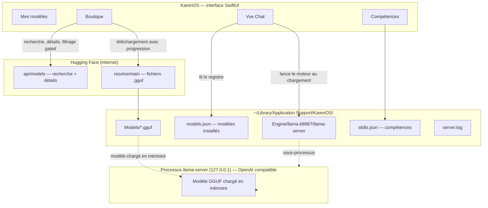
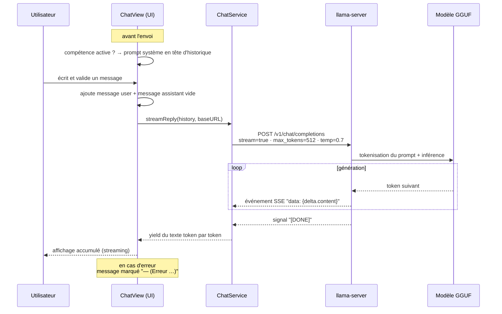
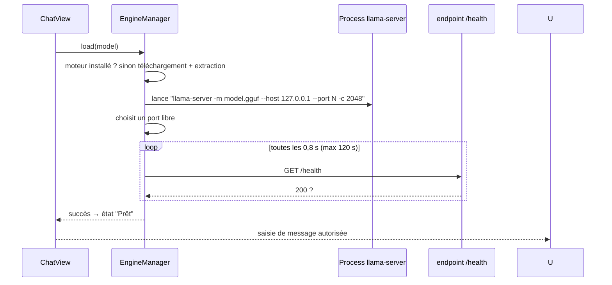
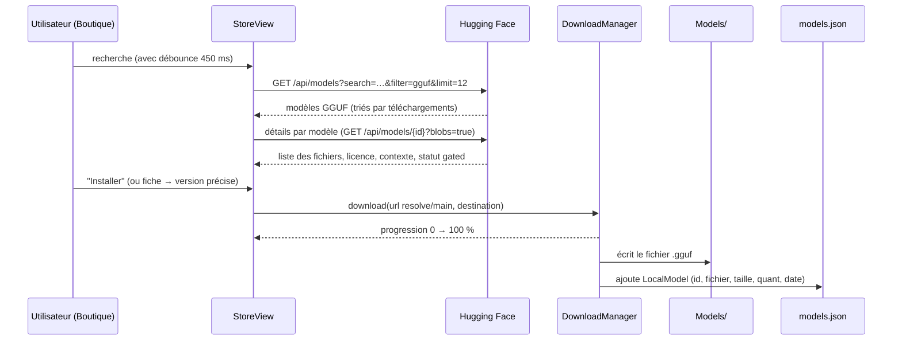
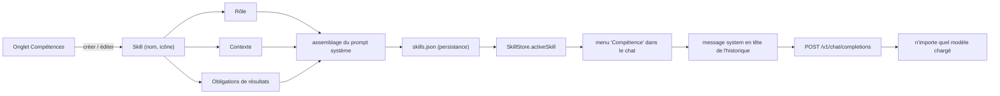

# Documentation de KarenOS

KarenOS est une application native macOS qui permet de **télécharger des modèles d'IA générative** depuis Hugging Face et de **discuter avec eux entièrement en local**. Elle embarque le moteur `llama-server` (llama.cpp) et n'envoie **aucune donnée sur internet** une fois le modèle chargé.

> **Auteur : Martial Zinsou** — 100 % Swift / SwiftUI, sans Xcode (compilation `swiftc`).

---

## Sommaire

1. [Vue d'ensemble](#1-vue-densemble)
2. [Architecture générale](#2-architecture-générale)
3. [Le parcours d'un message (inférence)](#3-le-parcours-dun-message-inférence)
4. [Téléchargement et gestion des modèles](#4-téléchargement-et-gestion-des-modèles)
5. [Les compétences](#5-les-compétences)
6. [Persistance et stockage](#6-persistance-et-stockage)
7. [Organisation du code](#7-organisation-du-code)
8. [Construction et lancement](#8-construction-et-lancement)
9. [Dépannage](#9-dépannage)
10. [Limites et évolutions](#10-limites-et-évolutions)

---

## 1. Vue d'ensemble

L'application se compose de **trois volets**, accessibles via la barre d'onglets.

### Mes modèles

Bibliothèque des modèles installés sur le disque. Cliquer sur un modèle lance le chat : le moteur démarre, le modèle est chargé en mémoire, puis les échanges se font en streaming.


### Boutique

Parcours de modèles GGUF **sélectionnés** (Qwen 0,5 → 3 B, SmolLM2, Phi-3) enrichis par une recherche Hugging Face. Chaque fiche indique la taille, la licence et le contexte, et permet d'installer une version quantisée précise avec progression.


### Compétences

Des **consignes réutilisables** — rôle, contexte, obligations de résultats — injectées automatiquement dans n'importe quel modèle.


---

## 2. Architecture générale

Le schéma ci-dessous décrit les blocs principaux et leurs relations :



Points clés :

- **Le moteur** est un sous-processus `llama-server` (llama.cpp, version épinglée `b8967`) qui expose une **API HTTP de type OpenAI** sur `127.0.0.1` et un **port libre** choisi à la volée.
- **L'app n'est jamais un serveur partagé** : le moteur ne répond que sur l'interface loopback, pendant que l'app est ouverte.
- **Tout passe par du streaming SSE** : les tokens s'affichent dès qu'ils sont générés.

---

## 3. Le parcours d'un message (inférence)

### 3.1 Déroulé complet



### 3.2 Détails de l'appel

Le moteur étant compatible OpenAI, l'app envoie un appel classique de chat :

```http
POST /v1/chat/completions
Content-Type: application/json
{
  "model": "local",
  "messages": [
    { "role": "system",    "content": "Rôle : … \n\n Contexte : … \n\n Obligations de résultats : …" },
    { "role": "user",      "content": "Bonjour !" },
    { "role": "assistant", "content": "…" }
  ],
  "stream": true,
  "max_tokens": 512,
  "temperature": 0.7
}
```

Réponse : une suite d'événements `data:` (SSE), chacun portant une fraction de texte dans `choices[0].delta.content`.

### 3.3 Mise en route d'un modèle

Le chargement d'un modèle suit une séquence contrôlée :



---

## 4. Téléchargement et gestion des modèles

### 4.1 Parcours dans la Boutique



### 4.2 Le registre des modèles installés

Un modèle « installé » se résume à :

| Champ | Rôle |
|---|---|
| `id` | identifiant Hugging Face (`Auteur/Modèle`) |
| `fileName` | nom du fichier `.gguf` téléchargé |
| `fileSize` | taille sur le disque |
| `quant` | quantification détectée (`q4_k_m`, `q8_0`…) |
| `installedAt` | date d'installation |

L'ordinateur ne stocke **que** le fichier `.gguf` et cette fiche : rien d'autre n'est téléchargé pour utiliser un modèle.

### 4.3 Filtrages appliqués

- Les modèles **gated** (accès restreint, ex. certaines licences) sont masqués.
- La sélection maison est épinglée : `Qwen2.5-0.5B/1.5B/3B-Instruct-GGUF`, `HuggingFaceTB/SmolLM2-360M/1.7B-Instruct-GGUF`, `microsoft/Phi-3-mini-4k-instruct-gguf`.
- Fichier « par défaut » choisi : `q4_k_m`, puis `q4_0`, `q4`, `q5_k_m`, `q3_k_m`, `q8_0`, sinon le plus petit.

---

## 5. Les compétences

### 5.1 Principe

Une **compétence** est un set de consignes **structuré en trois champs** :

| Champ | Question guidée |
|---|---|
| **Rôle** | Qui doit être le modèle ? |
| **Contexte** | Quelle situation, quel public, quelles infos nécessaires ? |
| **Obligations de résultats** | Que doit-il impérativement livrer ? |

Elle est **sauvegardée sur le disque** (`skills.json`) et **indépendante du modèle** : la même compétence fonctionne avec Qwen, SmolLM ou Phi-3.

### 5.2 Flux de bout en bout



### 5.3 Exemple concret

Compétence « Correcteur de code » :

```
Rôle : Ingénieur logiciel senior spécialisé en revue de code
Contexte : L'utilisateur soumet du code Swift ou d'autres langages et veut l'améliorer.
Obligations de résultats : Fournir chaque correction sous forme de code complet,
expliquer chaque erreur en une phrase et proposer un test.
```

Chaque fois qu'une conversation démarre avec cette compétence **active**, ce bloc est envoyé en **message système** avant le premier message de l'utilisateur — quel que soit le modèle chargé. La compétence active est **mémorisée** d'une session à l'autre.

---

## 6. Persistance et stockage

Tout est situé dans le dossier de support de l'application :

```
~/Library/Application Support/KarenOS/
├── Engine/
│   └── llama-b8967/
│       └── llama-server          ← moteur d'inférence
├── Models/
│   └── Auteur__Modele/
│       └── modele-...q4_k_m.gguf ← fichiers GGUF installés
├── models.json                    ← registre des modèles installés
├── skills.json                    ← compétences + compétence active
└── server.log                     ← journaux du moteur
```

Les noms de fichiers GGUF occupent plusieurs centaines de Mo à quelques Go ; les métadonnées (`models.json`, `skills.json`) sont des fichiers JSON minuscules chargés au démarrage.

---

## 7. Organisation du code

```
Sources/KarenOS/
├── KarenOSApp.swift        → cycle de vie de l'app, onglets, badge d'état du moteur
├── AppPaths.swift          → chemins du dossier de support
├── Models.swift            → RemoteModel (HF) + LocalModel (installé)
├── ModelStore.swift        → registre, téléchargements, déduplication, persistance
├── HuggingFaceClient.swift → API Hugging Face (recherche, détails, modèle sélection)
├── DownloadManager.swift   → téléchargements avec progression et retries
├── EngineManager.swift     → installation/lancement de llama-server, port libre, /health
├── ChatService.swift       → appels OpenAI + lecture du flux SSE
├── ChatView.swift          → interface du chat, streaming, compétence active
├── LibraryView.swift       → Mes modèles
├── StoreView.swift         → Boutique (recherche, fiche, bouton d'installation)
├── StoreDetailSheet.swift  → fiche détaillée d'un modèle (choix de quantification)
├── Skills.swift            → modèle Skill + SkillStore (persistance)
├── SkillsView.swift        → onglet Compétences (liste, éditeur, modèles d'exemples)
└── Errors.swift            → messages d'erreur localisés
```

---

## 8. Construction et lancement

Pré-requis : **macOS 13+** et les outils de ligne de commande (`xcode-select --install`) — **pas besoin d'Xcode**.

```bash
Scripts/make-app.sh          # compile (swiftc -O) et assemble build/KarenOS.app
Scripts/make-app.sh --run    # compile puis ouvre l'app
Scripts/make-icon.sh         # (re)génère l'icône Packaging/KarenOS.icns
```

Au premier lancement, l'app télécharge le moteur `llama-server` (~8 Mo) depuis les releases GitHub de llama.cpp selon l'architecture (`x64` ou `arm64`) et l'installe dans le dossier de support.

---

## 9. Dépannage

| Symptôme | Cause probable | Correctif |
|---|---|---|
| « Impossible de charger le modèle » | Fichier corrupte ou moteur arrêté | Relire via Mes modèles → « Réessayer » |
| Bouton « Installer » grisé | Fichier GGUF non encore détecté | Ouvrir la fiche du modèle (résolution à la demande) puis installer |
| Téléchargement lent / erreur | Réseau ou quota Hugging Face | Réessayer ; les retries sont automatiques (×3) |
| Le moteur reste à « installation » | Premier téléchargement GitHub | Patienter (progress bar dans la barre d'outils) |
| Erreur affichée en rouge sur une carte | Modèle gated ou erreur HTTP | Choisir un autre modèle |

---

## 10. Limites et évolutions

- **Contexte court** : fenêtre fixée à `2048` tokens (`-c 2048`), réponse limitée à `512` tokens.
- **Un modèle actif à la fois** : le moteur ne charge qu'un modèle par session de chat.
- **Petits modèles** : idéal pour Qwen 0,5–3 B, SmolLM2 et Phi-3 ; les gros modèles (7 B+) restent fonctionnels mais lents sur CPU Intel.
- Évolutions possibles : historique de conversations, résumés automatiques, sélection explicite de la fenêtre de contexte, chargement de plusieurs modèles.