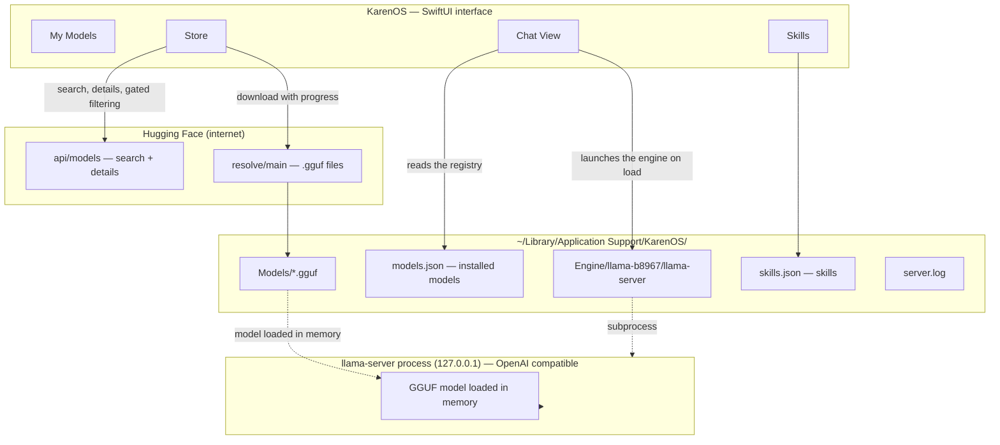
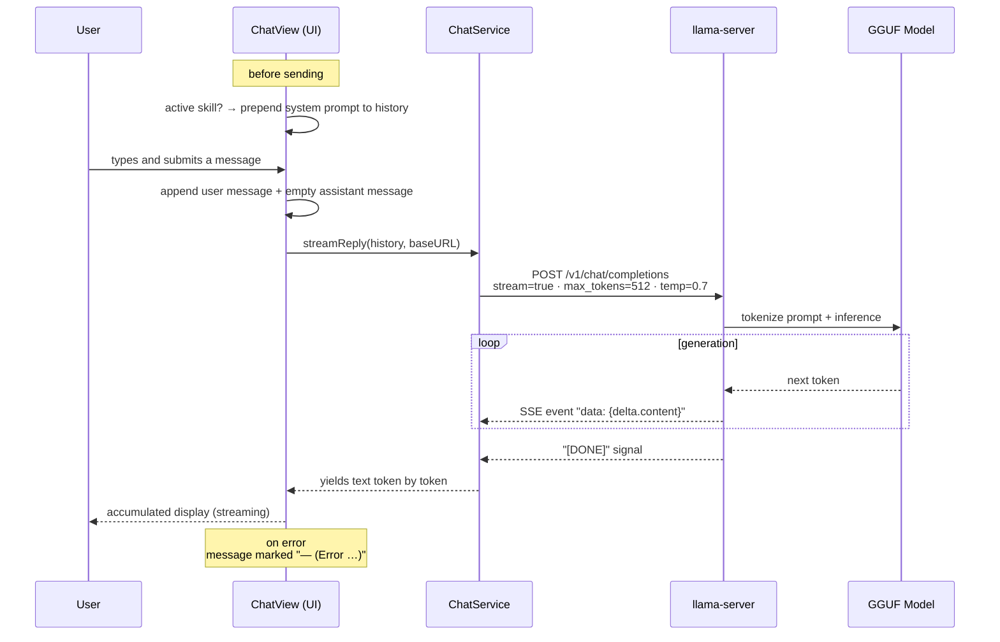
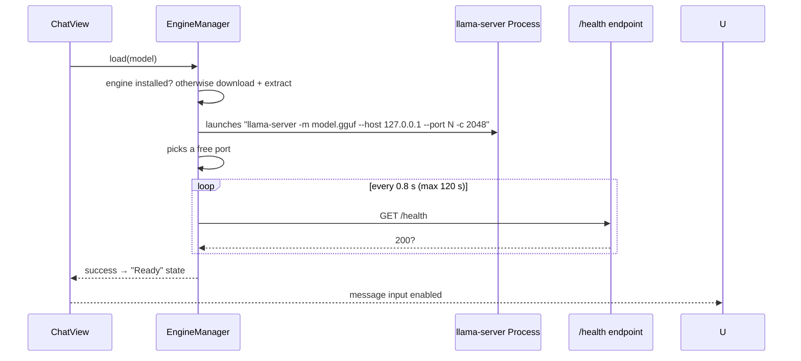
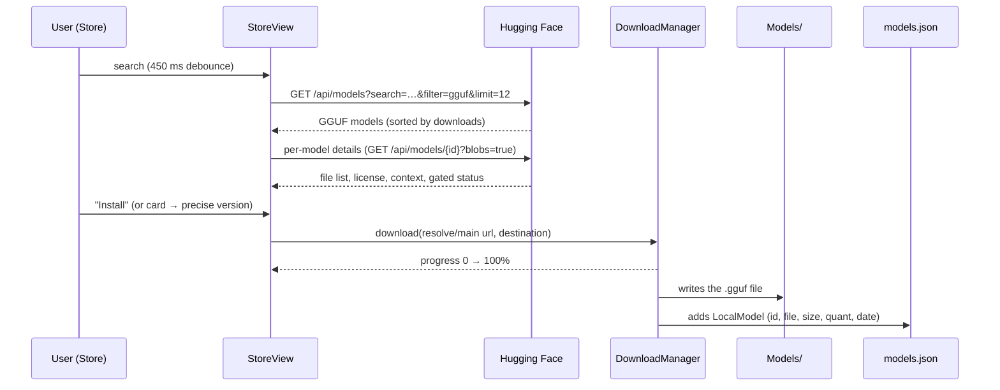
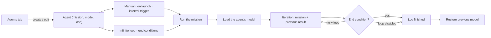
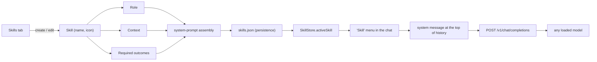

# KarenOS Documentation (US English)

**Auteur : Martial Zinsou**

<!--
    SEO — KarenOS · Project reference: https://github.com/martialzinsou/KarenOs
    Author   : Martial Zinsou
    Role     : IT Director (DSI)
    Title    : KarenOS Documentation (US English)
    Description : Complete US English documentation of KarenOS, the native macOS app for 100% local generative AI: install, models, autonomous agents, multimodal, skills, persistence and troubleshooting.
    Keywords : karenos, documentation, local ai, macos, swiftui, llama.cpp, ai agents, multimodal, guide, dsi, it director, IT management, digital transformation, governance, AI infrastructure
    Language : en
-->


KarenOS is a native macOS application that **downloads generative AI models** from Hugging Face and lets you **chat with them fully offline**. It embeds the `llama-server` engine (llama.cpp) and sends **no data over the internet** once a model is loaded.

> **Author: Martial Zinsou (US English translation)** — 100% Swift / SwiftUI, no Xcode (`swiftc` build).

---

## Table of contents

1. [Overview](#1-overview)
2. [General architecture](#2-general-architecture)
3. [The journey of a message (inference)](#3-the-journey-of-a-message-inference)
4. [Downloading and managing models](#4-downloading-and-managing-models)
5. [Autonomous agents](#5-autonomous-agents)
6. [Multimodal (images, videos, audio, voice)](#6-multimodal-images-videos-audio-voice)
7. [Skills](#7-skills)
8. [Persistence and storage](#8-persistence-and-storage)
9. [Code organization](#9-code-organization)
10. [Build and launch](#10-build-and-launch)
11. [Troubleshooting](#11-troubleshooting)
12. [Limits and roadmap](#12-limits-and-roadmap)

---

## 1. Overview

The app is made of **four panes**, reachable from the tab bar.

### My Models

Library of the models installed on disk. Clicking a model starts the chat: the engine launches, the model is loaded into memory, then exchanges stream in real time.


### Store

Browse **curated** GGUF models (Qwen 0.5 → 3 B, SmolLM2, Phi-3) enriched by a Hugging Face search. Each card shows the size, license, and context, and lets you install a precise quantized version with a progress bar.


### Skills

**Reusable instructions** — role, context, required outcomes — injected automatically into any model.


### Agents

**Autonomous missions**: describe the mission, pick the model, choose the **trigger** (manual, on launch, every X seconds), an **infinite loop**, and **end conditions**. The app automatically loads the chosen model, runs the mission in a loop, then restores the previous model.


---

## 2. General architecture

The diagram below describes the main blobs and their relationships:



Key points:

- **The engine** is a `llama-server` subprocess (llama.cpp, pinned version `b8967`) exposing an **OpenAI-style HTTP API** on `127.0.0.1` and a **free port** chosen on the fly.
- **The app is never a shared server**: the engine only answers on the loopback interface, while the app is open.
- **Everything flows through SSE streaming**: tokens appear as soon as they are generated.

---

## 3. The journey of a message (inference)

### 3.1 Full flow



### 3.2 Call details

As the engine is OpenAI-compatible, the app issues a standard chat call:

```http
POST /v1/chat/completions
Content-Type: application/json
{
  "model": "local",
  "messages": [
    { "role": "system",    "content": "Role: … \n\n Context: … \n\n Required outcomes: …" },
    { "role": "user",      "content": "Hello!" },
    { "role": "assistant", "content": "…" }
  ],
  "stream": true,
  "max_tokens": 512,
  "temperature": 0.7
}
```

Response: a series of `data:` events (SSE), each carrying a fraction of text in `choices[0].delta.content`.

### 3.3 Starting a model

Loading a model follows a controlled sequence:



---

## 4. Downloading and managing models

### 4.1 Store journey



### 4.2 Installed-model registry

An "installed" model boils down to:

| Field | Role |
|---|---|
| `id` | Hugging Face identifier (`Author/Model`) |
| `fileName` | name of the downloaded `.gguf` file |
| `fileSize` | size on disk |
| `quant` | detected quantization (`q4_k_m`, `q8_0`…) |
| `installedAt` | install date |

The computer stores **only** the `.gguf` file and this record: nothing else is downloaded to use a model.

### 4.3 Applied filters

- **Gated** models (restricted access, e.g. certain licenses) are hidden.
- The curated selection is pinned: `Qwen2.5-0.5B/1.5B/3B-Instruct-GGUF`, `HuggingFaceTB/SmolLM2-360M/1.7B-Instruct-GGUF`, `microsoft/Phi-3-mini-4k-instruct-gguf`.
- Default file chosen: `q4_k_m`, then `q4_0`, `q4`, `q5_k_m`, `q3_k_m`, `q8_0`, otherwise the smallest.

---

## 5. Autonomous agents

### 5.1 Principle

An **agent** is an autonomous mission: you give it a **mission**, a **model**, a **trigger**, a **loop**, and **end conditions**. It runs on its own, continuously, without human intervention.

| Setting | Explanation |
|---|---|
| **Mission** | The system prompt given to the agent (goal, method, deliverables). |
| **Model** | The model used for the mission — it is **loaded automatically**, even if another model was active. |
| **Trigger** | **Manual** ("Run" button), **on app launch**, or **every X seconds**. |
| **Loop** | "Single" = one run; "Infinite" = the agent keeps restarting with its own previous result as context. |
| **End conditions** | Stop after **N iterations**, after a **maximum duration**, or when the answer contains a **success keyword** (e.g. `DONE`). |

### 5.2 Execution flow



Iteration details:

1. **Load the agent's model** (if different from the active one).
2. **Call** `POST /v1/chat/completions` with the mission as the system prompt.
3. If the agent loops, the **previous result** is re-injected: "Continue your mission. Your latest result: …".
4. The result is appended to the **execution log** (iteration, timestamp, text).
5. **End-condition check** → stop or next iteration.
6. At the end: **restore the previous model** (or stop the engine if no model was active).

### 5.3 Agent registry

`~/Library/Application Support/KarenOS/agents.json`:

```json
{
  "agents": [
    {
      "id": "11111111-2222-3333-4444-555555555555",
      "name": "Code reviewer",
      "icon": "hammer",
      "mission": "Role: senior software engineer specialized in code review…",
      "modelID": "Qwen/Qwen2.5-0.5B-Instruct-GGUF",
      "trigger": {"kind": "manual"},
      "loopForever": false,
      "endConditions": [{"kind": "maxIterations", "value": 3}],
      "createdAt": 811610000.5
    }
  ]
}
```

| Field | Role |
|---|---|
| `trigger.kind` | `manual`, `onLaunch`, or `interval` (with `seconds`). |
| `loopForever` | `true` → infinite loop. |
| `endConditions` | Array: `maxIterations`, `maxDuration` (minutes), `successKeyword`. |

### 5.4 One agent at a time

The engine loads a single model: only one mission can run at a time. The **Pause / Resume / Stop** buttons and the **execution log** are visible in the running agent's card. On app launch, agents with an "on launch" trigger start automatically.

---

## 6. Multimodal (images, videos, audio, voice)

### 6.1 What you can send

The chat input bar now offers three inputs:

1. **Paperclip** — attach files to the message: **images**, **videos**, **audio**, or any other file.
2. **Microphone** — **dictate your message to the app** by voice (local speech recognition).
3. **Text field** — classic input.

Attachments show as thumbnails before sending, then inside the message bubble. Right-click reveals the file in Finder.

### 6.2 Speech recognition

- Dictation uses the macOS **Speech** framework (**`SFSpeechRecognizer`**, on-device when the voice model is available: `requiresOnDeviceRecognition = true`).
- On first use, macOS asks for **Microphone** and **Speech Recognition** permissions (described in `Info.plist`).
- The recognized text is **inserted into the input field** and can be edited before sending.

### 6.3 Vision: when the model really sees the image

A chat model only understands an image if it is a **vision** model (e.g. Llava / Qwen-VL) paired with a **`*.mmproj`** file stored next to the `*.gguf`.

- On every load, the app **auto-detects** the presence of a `.mmproj` (`EngineManager.hasVision`).
- If present, attached images are sent in the OpenAI vision format:
  `{"type":"image_url","image_url":{"url":"data:image/png;base64,…"}}`.
- Without a `.mmproj`, **the image stays an attachment** (shown in the conversation) and only the text goes to the model.

> On the default text-only models (Qwen, SmolLM, Phi), vision is thus not active — the model "sees" the attachment reference but not its content.

---

## 7. Skills

### 7.1 Principle

A **skill** is a set of instructions **structured in three fields**:

| Field | Guiding question |
|---|---|
| **Role** | Who should the model be? |
| **Context** | What situation, what audience, what info is needed? |
| **Required outcomes** | What must it absolutely deliver? |

It is **saved to disk** (`skills.json`) and **model-independent**: the same skill works with Qwen, SmolLM, or Phi-3.

### 7.2 End-to-end flow



### 7.3 Concrete example

"Code reviewer" skill:

```
Role: senior software engineer specialized in code review
Context: The user submits Swift or other language code and wants it improved.
Required outcomes: Provide each fix as complete code, explain each error in
one sentence, and suggest a test.
```

Every time a conversation starts with this skill **active**, this block is sent as the **system message** before the user's first message — regardless of the loaded model. The active skill is **remembered** from one session to the next.

---

## 8. Persistence and storage

Everything lives in the app's support folder:

```
~/Library/Application Support/KarenOS/
├── Engine/
│   └── llama-b8967/
│       └── llama-server          ← inference engine
├── Models/
│   └── Author__Model/
│       └── model-...q4_k_m.gguf ← installed GGUF files
├── models.json                    ← installed-model registry
├── skills.json                    ← skills + active skill
└── server.log                     ← engine logs
```

GGUF file names take up hundreds of MB to a few GB; the metadata (`models.json`, `skills.json`) are tiny JSON files loaded at startup.

---

## 9. Code organization

```
Sources/KarenOS/
├── KarenOSApp.swift        → app lifecycle, tabs, engine status badge
├── AppPaths.swift          → support-folder paths
├── Models.swift            → RemoteModel (HF) + LocalModel (installed)
├── ModelStore.swift        → registry, downloads, dedup, persistence
├── HuggingFaceClient.swift → Hugging Face API (search, details, curated models)
├── DownloadManager.swift   → downloads with progress and retries
├── EngineManager.swift     → installs/launches llama-server, free port, /health
├── ChatService.swift       → OpenAI calls + SSE stream parsing
├── ChatView.swift          → chat UI, streaming, active skill
├── LibraryView.swift       → My Models
├── StoreView.swift         → Store (search, card, install button)
├── StoreDetailSheet.swift  → model detail sheet (quantization choice)
├── Skills.swift            → Skill model + SkillStore (persistence)
├── SkillsView.swift        → Skills tab (list, editor, example templates)
└── Errors.swift            → localized error messages
```

---

## 10. Build and launch

Prerequisites: **macOS 13+** and the command-line tools (`xcode-select --install`) — **no Xcode required**.

```bash
Scripts/make-app.sh          # compiles (swiftc -O) and assembles build/KarenOS.app
Scripts/make-app.sh --run    # compiles then opens the app
Scripts/make-icon.sh         # (re)generates the Packaging/KarenOS.icns icon
```

On first launch, the app downloads the `llama-server` engine (~8 MB) from llama.cpp GitHub releases according to the architecture (`x64` or `arm64`) and installs it into the support folder.

---

## 11. Troubleshooting

| Symptom | Likely cause | Fix |
|---|---|---|
| "Unable to load model" | Corrupted file or engine stopped | Reload via My Models → "Retry" |
| "Install" button grayed out | GGUF file not detected yet | Open the model card (on-demand resolution) then install |
| Slow / failing download | Network or Hugging Face quota | Retry; retries are automatic (×3) |
| Engine stuck at "installing" | First GitHub download | Wait (progress bar in the toolbar) |
| Red error on a card | Gated model or HTTP error | Pick another model |

---

## 12. Limits and roadmap

- **Short context**: window fixed at `2048` tokens (`-c 2048`), reply capped at `512` tokens.
- **One active model at a time**: the engine loads a single model per chat session.
- **Small models**: ideal for Qwen 0.5–3 B, SmolLM2, and Phi-3; bigger models (7 B+) still work but are slow on Intel CPU.
- Possible evolutions: conversation history, automatic summaries, explicit context-window selection, loading multiple models.