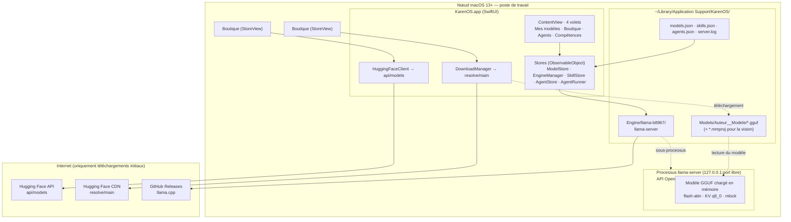
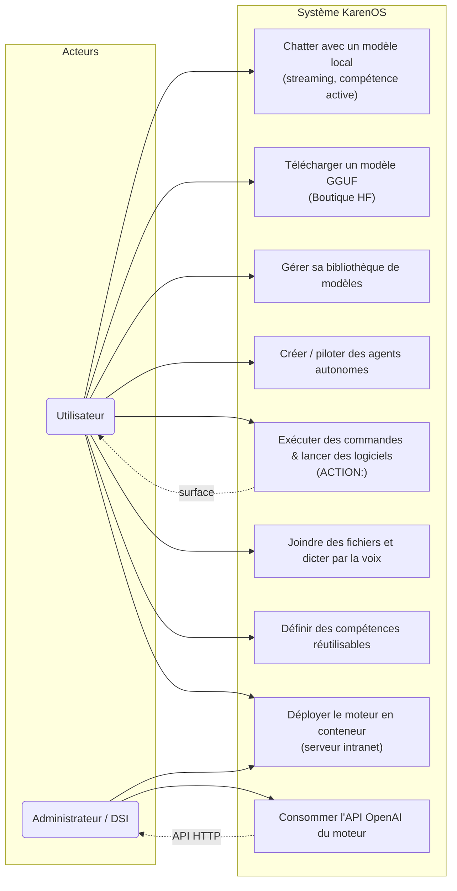
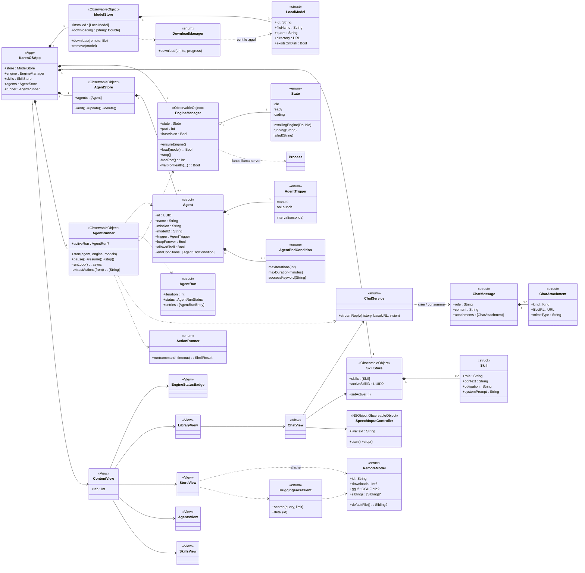
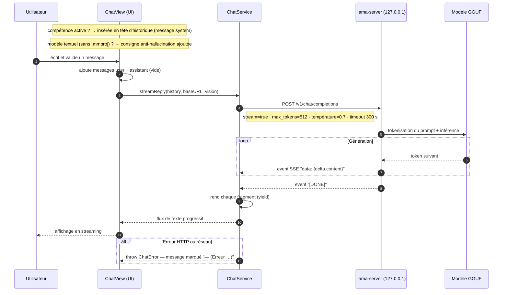
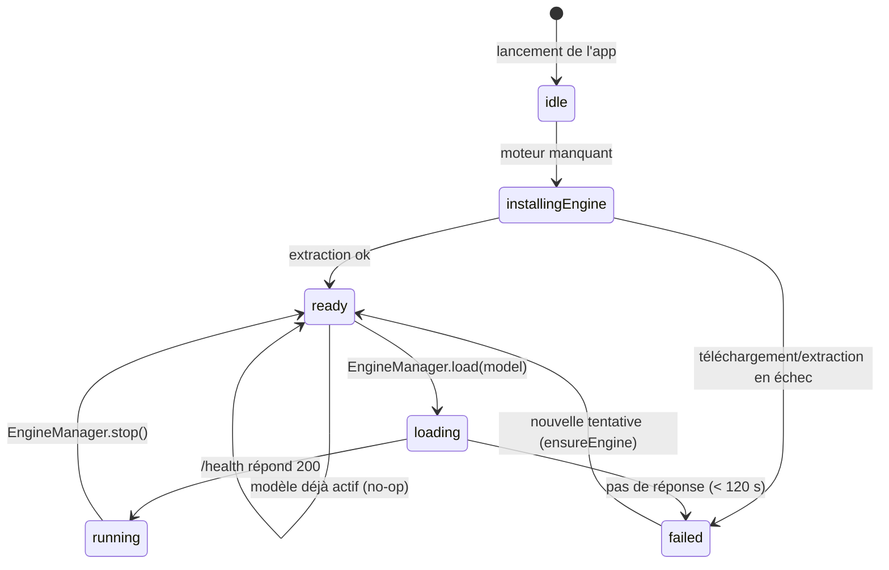
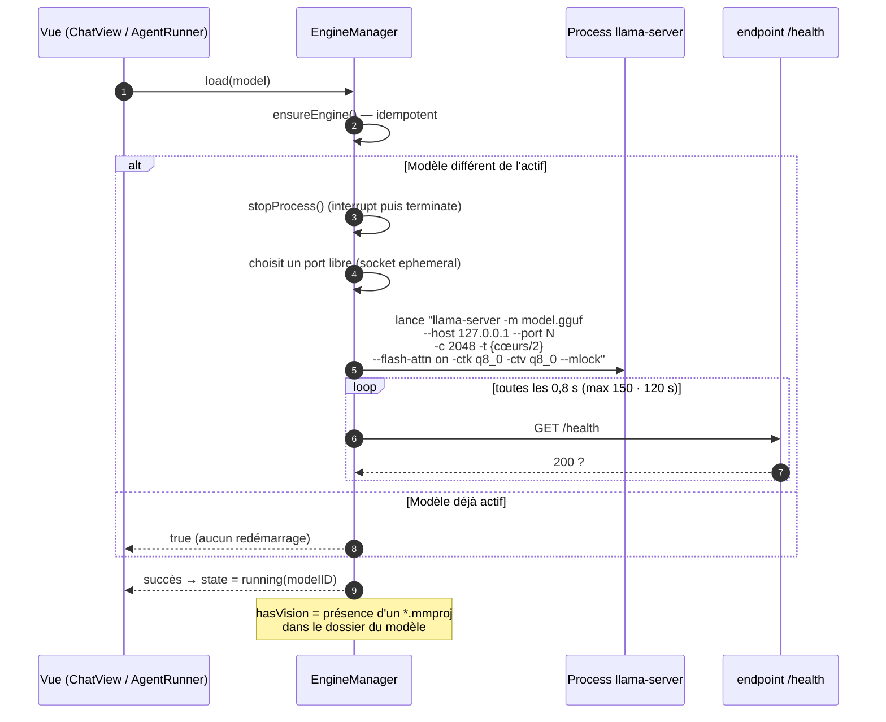
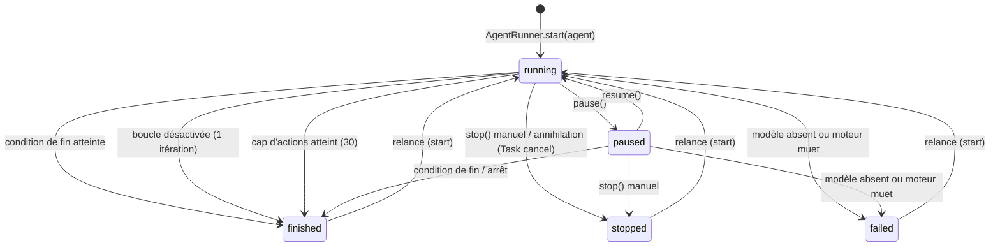
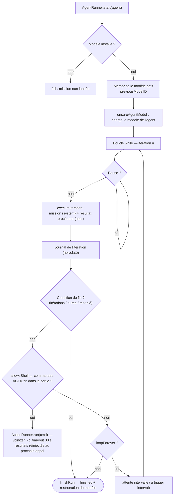

<!--
    SEO — KarenOS · Référence projet : https://github.com/martialzinsou/KarenOs
    Auteur   : Martial Zinsou
    Fonction : Directeur des Systèmes d'Information (DSI / IT Director)
    Titre    : KarenOS — page encyclopédique (style Wikipédia)
    Description : Page de présentation détaillée de KarenOS : application macOS d'IA générative 100 % locale — partie documentaire, architecture et spécifications techniques avec diagrammes UML.
    Mots-clés : karenos, ia locale, macos, swiftui, llama.cpp, agents ia, multimodal, gguf, huggingface, dsi, directeur informatique, it director, gouvernance it, transformation digitale, infrastructure ia
    Langue   : fr
-->

# KarenOS

| | |
|---|---|
| **Type** | Application de bureau (macOS) — interface de chat avec IA générative locale, agents autonomes et multimodal |
| **Développeur** | Martial Zinsou |
| **Première version** | 1.0.0 (2026) |
| **Dernière version** | 1.0.0 (tag `v1.0.0`) |
| **Dépôt** | [github.com/martialzinsou/KarenOs](https://github.com/martialzinsou/KarenOs) |
| **État** | En développement actif |
| **Écrit en** | Swift 5.8+ / SwiftUI (100 % natif, sans Xcode — compilation `swiftc`) |
| **Moteur d'inférence** | `llama-server` (llama.cpp) — API compatible OpenAI |
| **Système d'exploitation** | macOS 13 et ultérieur (Ventura+) — architectures x64 et arm64 |
| **Licence** | MIT |
| **Distributions** | [Release v1.0.0 (zip)](https://github.com/martialzinsou/KarenOs/releases/tag/v1.0.0) · image conteneur [GHCR](https://github.com/users/martialzinsou/packages/container/package/karenos%2Fkarenos-llama-server) |

**KarenOS** est une application native macOS qui permet de **télécharger des modèles d'IA générative** (formats GGUF) depuis Hugging Face et de **dialoguer avec eux entièrement en local**, sans aucune transmission de données vers Internet une fois le modèle chargé. Elle embarque un moteur d'inférence `llama-server` (llama.cpp) en sous-processus, expose une API de type OpenAI, et ajoute un socle de **productivité professionnel** : agents autonomes capables de lancer des logiciels et d'exécuter des commandes, saisie multimodale (images, vidéos, audio, dictée vocale), et compétences réutilisables.

---

## Sommaire

**Partie documentaire**

1. [Description générale](#1-description-générale)
2. [Présentation fonctionnelle](#2-présentation-fonctionnelle)
3. [Positionnement : une IA locale en environnement professionnel](#3-positionnement--une-ia-locale-en-environnement-professionnel)
4. [Historique des versions](#4-historique-des-versions)
5. [Distribution et formats](#5-distribution-et-formats)

**Partie technique**

6. [Vue d'ensemble de l'architecture](#6-vue-densemble-de-larchitecture)
7. [Cas d'utilisation](#7-cas-dutilisation)
8. [Diagramme de classes](#8-diagramme-de-classes)
9. [Parcours d'un message (inférence en streaming)](#9-parcours-dun-message-inférence-en-streaming)
10. [Cycle de vie du moteur et chargement des modèles](#10-cycle-de-vie-du-moteur-et-chargement-des-modèles)
11. [Les agents autonomes — conception et diagramme d'états](#11-les-agents-autonomes--conception-et-diagramme-détats)
12. [Le multimodal](#12-le-multimodal)
13. [Persistance et stockage](#13-persistance-et-stockage)
14. [Sécurité et protection des données](#14-sécurité-et-protection-des-données)
15. [Exigences, réglages et performances](#15-exigences-réglages-et-performances)
16. [Déploiement conteneur (serveurs DSI)](#16-déploiement-conteneur-serveurs-dsi)
17. [Limites et évolutions](#17-limites-et-évolutions)
18. [Références](#18-références)

---

# Partie documentaire

## 1. Description générale

KarenOS se présente comme une application de bureau « clé en main » pour exploiter un **grand modèle de langage local** sans abonnement, sans compte et sans infrastructure cloud. L'utilisateur installe un modèle ≥ quelques centaines de mégaoctets, et toutes les inférences sont exécutées sur sa propre machine par un processus `llama-server`.

Trois choix structurants :

- **La souveraineté des données.** Aucun prompt, aucune pièce jointe, aucun résultat ne quitte l'ordinateur. La seule connexion réseau est le **téléchargement initial des modèles** depuis Hugging Face et celui du moteur depuis les releases GitHub de llama.cpp.
- **L'interopérabilité.** Le moteur parlant le protocole HTTP d'OpenAI (`/v1/chat/completions`, streaming **SSE**), KarenOS n'invente aucune API propriétaire : le même moteur peut être consommé par tout client compatible.
- **La productivité locale.** Au-delà du chat, KarenOS pilote les capacités de la machine : l'utilisateur peut confier des **missions** à des agents qui bouclent, observent, exécutent des commandes shell, lancent des applications et journalisent chaque itération.

Chapô technique : l'application est écrite en **Swift / SwiftUI** et compilée sans Xcode (`Scripts/make-app.sh`, `swiftc -O`). Les stores de données sont des `ObservableObject` ; la persistance repose sur des fichiers JSON atomiques dans le dossier Application Support.

## 2. Présentation fonctionnelle

L'interface, un `TabView` à quatre volets, est coiffée d'un en-tête de marque (logo « Noyau local ») et d'un badge d'état du moteur :

| Volet | Rôle |
|---|---|
| **Mes modèles** | Bibliothèque des modèles installés ; lancer un chat en streaming avec le modèle choisi |
| **Boutique** | Catalogue de modèles GGUF (sélection maison épinglée + recherche Hugging Face), fiches détaillées (taille, licence, contexte, quantification), téléchargement avec progression |
| **Agents** | Création et pilotage de missions autonomes : déclencheur, boucle, conditions de fin, journal d'exécution, actions shell |
| **Compétences** | Consignes réutilisables structurées (rôle, contexte, obligations de résultats) injectées dans n'importe quel modèle |

Fonctionnalités transverses : **dictée vocale locale** (framework *Speech*, préférence *on-device*), **pièces jointes** (image/vidéo/audio/fichier) avec **mode vision** automatique lorsque le modèle en dispose (`*.mmproj`), **streaming** des réponses token par token, et **consigne anti-hallucination** appliquée aux modèles textuels.

## 3. Positionnement : une IA locale en environnement professionnel

KarenOS est pensé pour les contextes où la **gouvernance des données** prime : cabinets, établissements de santé, collectivités, directions informatiques (DSI) soumises à des exigences de souveraineté numérique ou de non-exportation de données. Pour un **directeur des systèmes d'information**, l'application s'appuie sur des briques standard du marché de l'IA locale – llama.cpp, format GGUF, Hub Hugging Face — et les conditionne dans un outil de bureau maîtrisable, sans dépendance cloud, ni compte tiers.

Deux surfaces d'exposition professionnelles :

1. **Poste de travail** : l'application macOS, autonome, hors-ligne une fois les modèles téléchargés.
2. **Serveur d'infrastructure** : une **image conteneur** `ghcr.io/martialzinsou/karenos/karenos-llama-server` (Linux x86_64, AVX2) publiée automatiquement par CI/CD, sur laquelle le moteur tourne en intranet et sert les postes du réseau (voir [§16](#16-déploiement-conteneur-serveurs-dsi)).

## 4. Historique des versions

| Version | Contenu marquant |
|---|---|
| **1.0.0** (2026) | Première publication structurée : chat streaming, boutique Hugging Face, moteur optimisé (AVX2 + BLAS Apple, flash-attention, cache KV `q8_0`, `mlock`), agents autonomes avec exécution d'actions shell, multimodal (pièces jointes + dictée), compétences, documentation bilingue FR/US, wiki, logo « Noyau local », image conteneur GHCR, référencement et balises DSI |

## 5. Distribution et formats

- **Application macOS** : bundle `KarenOS.app` distribué en zip (`KarenOS-1.0.0-macOS.zip`, ~2,8 Mo) via la Release GitHub [`v1.0.0`](https://github.com/martialzinsou/KarenOs/releases/tag/v1.0.0). Au premier lancement, l'app télécharge le moteur `llama-server` (~8 Mo) selon l'architecture (`x64` ou `arm64`).
- **Image conteneur (moteur seul, Linux)** : publiée sur le GitHub Container Registry sous `ghcr.io/martialzinsou/karenos/karenos-llama-server`, reconstruite automatiquement à chaque tag `v*` par l'action GitHub `.github/workflows/container.yml`.
- **Documentation** : wiki GitHub bilingue (25 pages FR/US), `README.md`, `docs/DOCUMENTATION.md` & `-EN`, page encyclopédique (ce document).

---

# Partie technique

## 6. Vue d'ensemble de l'architecture

KarenOS est une application **monolithique structurée en couches** dont le cœur est un sous-processus `llama-server` locale. Le diagramme de composants et de déploiement ci-dessous décrit les blocs, leurs artéfacts de déploiement et leurs liens.



Le design garantit que :

- le moteur n'écoute que sur l'**interface loopback** (`--host 127.0.0.1`) sur un **port libre** choisi à la volée (repli 8391) ;
- l'application n'est jamais un serveur partagé — le processus vit et meurt avec l'app ;
- les échanges sont du **streaming SSE**, affichés token par token.

## 7. Cas d'utilisation



## 8. Diagramme de classes

Les entités centrales et leurs relations (`KarenOSApp` assemble cinq stores injectés en `environmentObject` ; chaque store pilote un fichier de persistance).



Lecture : `KarenOSApp` possède (composition) les cinq stores ; `ContentView` orchestre les vues ; `EngineManager` devient l'unique gardien du processus `llama-server` (états, port, `/health`, vision) ; `AgentRunner` pilote la boucle d'exécution et délègue l'exécution shell à `ActionRunner` ; l'appel réseau passe exclusivement par `ChatService`.

## 9. Parcours d'un message (inférence en streaming)



En mode **vision** (`hasVision == true`, détection d'un `*.mmproj`), `ChatService.apiContent` transforme le message en tableau multi-part conforme OpenAI : `[{"type":"text",…},{"type":"image_url","image_url":{"url":"data:image/png;base64,…"}}]`. Toute pièce jointe **non transmise** (vidéo, audio, fichier, ou image sans vision) est signalée au modèle sous forme de texte, ce qui évite les délires du type « ERROR: Cannot read… ».

## 10. Cycle de vie du moteur et chargement des modèles

### 10.1 Machine à états du moteur



Le chargement suit une séquence contrôlée (interrogation de `/health` toutes les 800 ms, 150 essais maximum) :



## 11. Les agents autonomes — conception et diagramme d'états

Un **agent** est décrit par un triplet métier : une **mission** (prompt système), un **modèle** exécutant, et un **gabarit d'exécution** — déclencheur (`manual`, `onLaunch`, `interval(seconds)`), boucle (`loopForever`), conditions de fin (`maxIterations`, `maxDuration` en minutes, `successKeyword`), et capacité **`allowsShell`** (rétro-compatible, désactivée par défaut) qui autorise l'exécution de commandes et de logiciels via les lignes `ACTION:`.

Le cycle de vie d'une mission est une machine à états explicite :



La boucle d'exécution, qui réinjecte le résultat précédent à chaque itération et rend les sorties de commandes à l'agent :



Détails d'ingénierie de `ActionRunner` :

- exécution via `/bin/zsh -lc` (shell de connexion : PATH Homebrew, `/usr/local`… résolu) ;
- lecture **concomitante** de `stdout` et `stderr` (deux pipes) pour éviter toute contention ;
- **garde-fou temporel** : terminaison du processus après 30 s (code de sortie 137 en pratique, SIGKILL) ;
- filet de sécurité global : **30 actions maximum par mission**, au-delà la mission conclut.

## 12. Le multimodal

Le multimodal est réalisé sans infrastructure annexe :

| Entrée | Technologie macOS | Comportement |
|---|---|---|
| **Image** | `*.mmproj` adjacent au GGUF → encodage base64, format OpenAI multi-part | Envoyée au modèle si vision ; sinon signalée comme pièce jointe non-lisible |
| **Vidéo / Audio / Fichier** | `NSOpenPanel` filtré par `UTType` | Pièce jointe affichée dans la conversation ; décrite au modèle par du texte |
| **Voix** | `SFSpeechRecognizer` (`Speech`), `requiresOnDeviceRecognition = true` prioritaires, repli automatique si le modèle on-device échoue | Transcription en direct (`liveText`), insertion dans la zone de saisie |

Les permissions (`Microphone`, `Reconnaissance vocale`) sont déclarées dans `Info.plist` et demandées au premier usage.

## 13. Persistance et stockage

Tout se trouve sous `~/Library/Application Support/KarenOS/` :

```
~/Library/Application Support/KarenOS/
├── Engine/
│   └── llama-b8967/
│       ├── llama-server                    ← moteur d'inférence (version épinglée)
│       └── (dylibs de support)
├── Models/
│   └── Auteur__Modele/                     ← un dossier par modèle HF
│       └── modele-...q4_k_m.gguf           ← fichiers GGUF (+ *.mmproj pour vision)
├── models.json                             ← registre des modèles installés
├── skills.json                             ← compétences + compétence active
├── agents.json                             ← agents autonomes (schéma versionné)
└── server.log                              ← journaux du moteur
```

Points notables :

- `models.json` est **dédupliqué** (`id + fileName`) au chargement ; `LocalModel.existsOnDisk` distingue un enregistrement orphelin d'un modèle réellement présent.
- `agents.json` et `skills.json` utilisent des **decodeurs tolérants** (champs absents = valeurs par défaut) ; `skills.json` migre l'ancien champ `instructions` vers `context`.
- l'écriture de tous les fichiers d'état se fait en **mode atomique** (`.write(options: .atomic)`).

## 14. Sécurité et protection des données

- **Aucune donnée sortante** : le seul trafic réseau est le téléchargement des modèles (Hugging Face) et du moteur (GitHub Releases). Le moteur n'écoute que sur `127.0.0.1`.
- **`--mlock`** : le modèle est verrouillé en mémoire physique (pas de swap), un atout pour la stabilité sur postes à mémoire contrainte.
- **Anti-hallucination** : les modèles textuels reçoivent une consigne système leur interdisant de produire des erreurs du type « ERROR: Cannot read … (this model does not support image input) » ; aucune pièce jointe n'est transmise à un modèle qui ne peut pas la traiter.
- **Cohabitation application/moteur** : le processus `llama-server` est arrêté proprement (`interrupt` → `terminate`) via `EngineManager.stop()` et à la fermeture de l'app (`willTerminateNotification`).
- La capacité shell d'un agent (`allowsShell`) est **opt-in par agent**, plafonnée à 30 actions et bornée à 30 s par commande.

## 15. Exigences, réglages et performances

**Exigences matérielles et logicielles**

- macOS 13 (Ventura) ou ultérieur, `xcode-select --install` (pas d'Xcode).
- x64 (Intel, instructions AVX2) ou arm64 ; CPU recommandé avec AVX2 ; GPU métal non exploité (les kernels BUNA/BLAS Apple sont utilisés pour la multiplication matricielle).
- Espace disque : taille des modèles choisis (dizaines de Mo à quelques Go).

**Réglages d'inférence appliqués par le moteur**

| Paramètre | Valeur | Effet |
|---|---|---|
| `-c` | `2048` | fenêtre de contexte fixe |
| `-t` | `activeProcessorCount / 2` | threads = cœurs physiques |
| `--flash-attn on` | — | attention flash (mémoire/bande passante) |
| `-ctk / -ctv` | `q8_0` | cache KV quantifié |
| `--mlock` | — | modèles verrouillés en RAM |
| `max_tokens` / `temperature` | `512` / `0.7` | bornes de l'appel chat |
| `/health` | 0,8 s × 150 | détection de disponibilité (< 120 s) |

**Performances mesurées (Mac Intel, moteur compilé localement b10025, AVX2 + BLAS)**

| Modèle | Débit |
|---|---|
| SmolLM2 (135 M) | ≈ 24 tokens/s (contre ≈ 17 avec la version de référence) |
| GLM-4-9B | ≈ 0,73 token/s (`-t 4`) contre ≈ 0,35 (`-t 8`) |

Le moteur distribué par l'app est la release **`b8967`** ; le binaire est également compilé **localement** (sources llama.cpp, AVX2 + BLAS Apple) dans l'installation de travail.

## 16. Déploiement conteneur (serveurs DSI)

L'image `ghcr.io/martialzinsou/karenos/karenos-llama-server` expose le **moteur brut** pour les serveurs d'infrastructure. Elle est construite en multi-étapes (Debian bookworm, compilation llama.cpp à la révision `a3e5b96`) et publiée automatiquement à chaque tag `v*` par `.github/workflows/container.yml` (droits `packages: write`, token natif GitHub Actions — sans secret PAT).

Utilisation type (modèles montés depuis l'hôte, rien ne part en cloud) :

```bash
docker run --rm -p 8080:8080 \
  -v "$PWD/models:/models" \
  -e GGML_N_CTX=2048 \
  ghcr.io/martialzinsou/karenos/karenos-llama-server:latest \
  -m /models/karenos-smol.gguf --host 0.0.0.0 --port 8080
```

Variantes utiles pour un DSI : `-t N` (threads de la machine), `--mlock` (verrouillage RAM, avec `--cap-add=IPC_LOCK`), `--n-gpu-layers 0` (CPU uniquement). Une machine macOS peut produire le même binaire Linux par compilation *croisée* (Zig, cible `x86_64-linux-gnu`), ce qui permet de pré-qualifier la version embarquée avant publication.

## 17. Limites et évolutions

Limites actuelles :

- **contexte court** : fenêtre fixée à 2 048 tokens, réponse bornée à 512 tokens ;
- **un modèle actif à la fois** : le moteur ne charge qu'un seul modèle par session ;
- **un agent à la fois** : la boucle d'agent et le chat partagent le même moteur ;
- **performances CPU modestes** pour les gros modèles (7 B+ peu fluides sur Mac Intel) ;
- pas de synthèse vocale des réponses ; la vision dépend de la disponibilité d'un `*.mmproj`.

Évolutions pressenties : historique de conversations, résumés automatiques, sélection explicite de la fenêtre de contexte, chargement multiple de modèles, serveur partagé optionnel par le biais de l'image conteneur.

---

## 18. Références

**Projet**

- Dépôt source : <https://github.com/martialzinsou/KarenOs>
- Wiki bilingue : <https://github.com/martialzinsou/KarenOs/wiki>
- Release v1.0.0 : <https://github.com/martialzinsou/KarenOs/releases/tag/v1.0.0>
- Image conteneur GHCR : `ghcr.io/martialzinsou/karenos/karenos-llama-server`

**Briques**

- llama.cpp : <https://github.com/ggml-org/llama.cpp>
- Hugging Face Hub (modèles GGUF) : <https://huggingface.co/models?filter=gguf>
- Protocole OpenAI (chat completions) : <https://platform.openai.com/docs/api-reference/chat>

---

*Document rédigé en style encyclopédique, basé sur le code source et la documentation du projet (récision a3e5b96 du moteur, app v1.0.0). Mis à jour le 21 septembre 2026.*